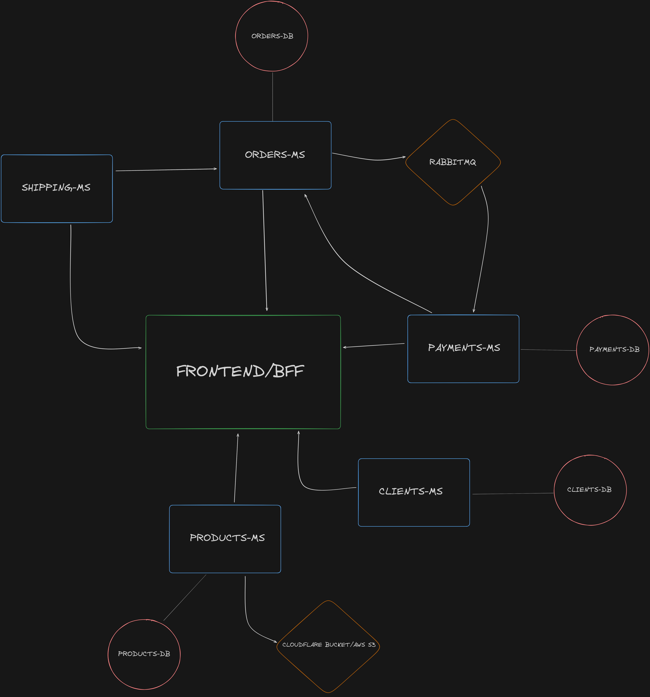

# ECOMMERCE BACKEND

This project was created to enforce knowledge about Java, Spring, Microservices and RabbitMQ.

# HOW TO RUN

The first requirement to get the services up on your machine is having docker installed on your computer, we will run all the services together with docker-compose

While i didnt founded any way to make it run with the docker commands we will need to enter in the folder of each service and run the following command:

- cd ./orders-ms
- mvn clean package -DskipTests
- cd ..
- cd ./payments-ms
- mvn clean package -DskipTests
- cd ..
- cd ./clients-ms
- mvn clean package -DskipTests
- cd ..
- cd ./products-ms
- mvn clean package -DskipTests
- cd ..
- cd ./shipping-ms
- mvn clean package -DskipTests
- cd ..

This command will package the java application generation the /target folder and creating the jar of the application.
After doing this we will need to move back to root folder of the submodule.
With the docker installed/running input those following commands:

Build docker images of each service
- docker-compose build 

Create the containers of each service instantiated on our root docker-compose.yml
- docker-compose up

You can find the postman collection on root folder too, the name of the file is collection.json.

# BASIC FLUXOGRAM

